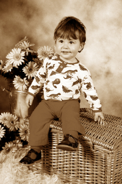

# Waar sal Mamma jou kry?

**02 Desember 1998 – 14 September 2000**  
*Simóne*

 

As my uurglas uitloop  
waar sal mamma jou kry?

Sal dit wees in die skemeraand  
of daar waar die son nooit ondergaan

Sal dit wees tussen die duisende blink sterretjies  
Waar jy grootoog vir my wink

Sit jy wagtend in die koelte  
van die doringboom geplant op jou graf

Sal mamma jou klokhelder laggie hoor  
as jy roep na my in die wind

Sal mamma jou speel speel vind in ‘n moddderpoel  
Vuil van kroontjie tot toontjie

Of al dansende met kaalvoetjies  
op die ritme van Hemelse musiek

Sal jy vir mamma by die Hemelpoort  
met een van jou nat soentjies inwag?

Sê vir mamma waar sal ek jou kry…
