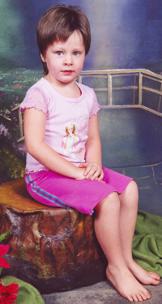

---
meta:
  - name: description
    content: Gediggie oor Zanri Botha 
  - name: keywords
    content: Heer, seer
---
## Zanri

**23 April 1998 – 18 Februarie 2004**  
*Zanri Botha*  

  

In my tuintjie sit ek en staar  
Die lente is kort om die draai  
Ek spit en plant en saai  
Alles om my tuintjie te verfraai  

Ek sit nog so en staar  
sien ek die eerste knop, 'n nuwe blaar  
Gou het blommetjies geblom in alle kleur  
My tuintjie het 'n nuwe geur  

'n Skoenlapper vlieg in volle fleur  
Van blom tot blom van alle kleur  
Ek sien haar in haar prag  
Van blom tot blom in Goddelike prag  

Jy wou nog oopmaak en verder blom  
Vir jou het die winter te gou gekom  
In die tuintjie het ons saam gespeel  
Maar die donderstorm kon ons nie voorspel  

Ons het die vooruitsig dat ons weer tesame  
sal speel in die baie spesiale tuin  
Waar elemente ons nie sal kan skei  

Liefste Poppie  
Ouma   

&copy; Riekie Brink
